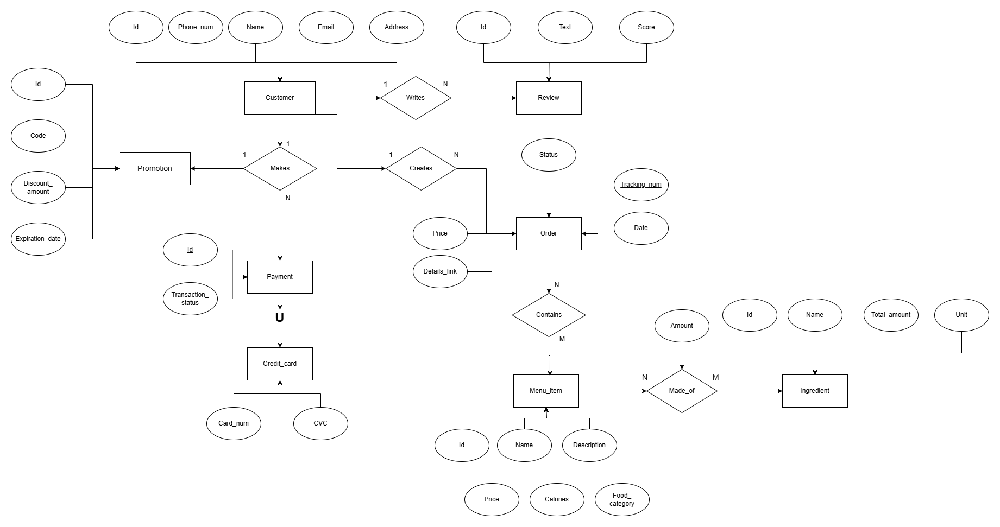
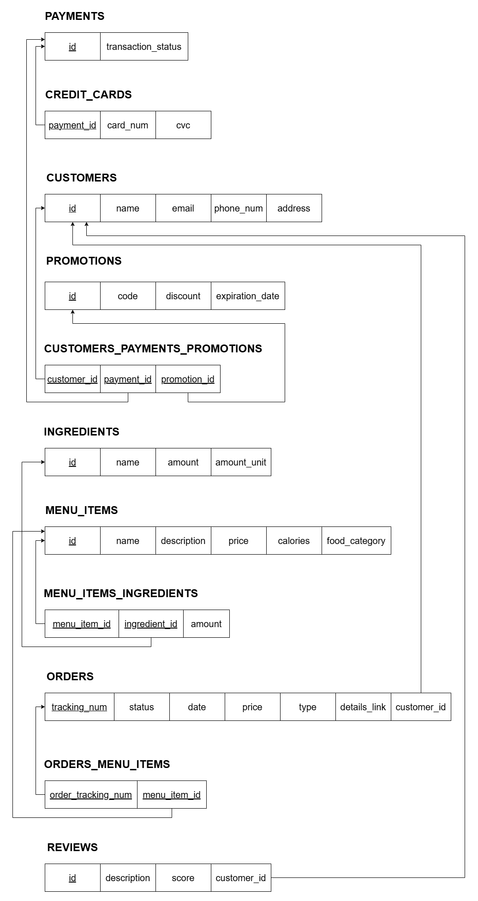

# Restaurant Back-end System

A back-end system for restaurant management, allowing the user to track customer info, menu items, ingredients, and more.

## How It's Made:
Tech used: Python, FastAPI, Uvicorn, SQLAlchemy, PyMySQL, PyTest, PyTest-Mock, HTTPx, Cryptography

This project was created as a group collaboration in class. We created a requirements document. 
Then we designed the app's database using a multi-step process. 

First, we used draw.io to make an EER diagram that establishes the app's entities, attributes, and the relationships between them.

Next, we converted the ER diagram into a database schema. The primary keys
are underlined. The foreign keys point to the primary key they associate with.

Finally, we implemented the schema into a MySQL database via Python's SQLAlchemy framework.

The professor offered boilerplate code for the project, including the package 
structure and code to connect to the MySQL database and run the FastAPI server. The team implemented the rest 
of the code pertaining to the restaurant. 

### Packages
* Controllers: contains CRUD operations for all the database relations
* Dependencies: allows the app to connect to the database server and create a Session
* Models: contains database relations implemented with SQLAlchemy
* Routers: contains endpoints that allows the back-end to connect to any front-end via HTTP requests. These requests are then sent to the Controllers package. Implemented with FastAPI.
* Schemas: conducts data validation for the HTTP Requests and Responses

## How to run the application:

### Create and connect to the MySQL database
Make a .env file in the dependencies package. Initialize the following key-value pairs
with relevant values using this format. Don't include quotation marks when storing values.

'''
db_host=localhost 
db_name=restaurant_db 
db_port=8080 
db_user=root 
db_password=password 
app_host=localhost 
app_port=8000
'''

Ensure the .env file is in .gitignore if sharing the project with anyone.

### Install necessary packages:  
'''
pip install -r requirements.txt
'''

### Run the server:
`uvicorn api.main:app --reload`

### Test API by built-in docs:
[http://127.0.0.1:8000/docs](http://127.0.0.1:8000/docs)

## Lessons Learned

### Daniel Semakov:
This project was my first experience making a back-end system, so I learned a lot about how they
work, both conceptually and concretely. I learned that the front-end and back-end of a
project communicate via HTTP Requests and Responses to a server, and that this data is sent via JSONs. 
Furthermore, I learned how to host this server using Uvicorn and how to implement endpoints via FastAPI. 

I already had experience working directly with MySQL from my "Database Design & Implementation" class. This project expanded my knowledge by teaching me how to 
interact with a database indirectly via the SQLAlchemy framework in Python. SQLAlchemy allows Python developers to
create classes that represent relations and functions that represent queries. Using this framework allowed the 
team to write the entire project in one language, making it more cohesive and easier to debug.

